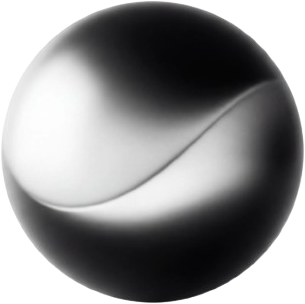
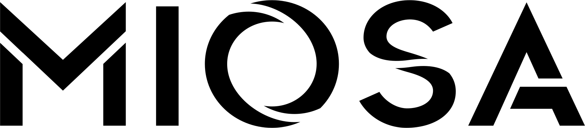

<p align="center">
  
  &nbsp;&nbsp;&nbsp;
  <picture>
    <source media="(prefers-color-scheme: dark)" srcset="assets/brand/miosa-logo-white-text.png">
    <source media="(prefers-color-scheme: light)" srcset="assets/brand/miosa-logo-black-text.png">
    
  </picture>
</p>

<h1 align="center">SOMA</h1>

<p align="center">
  <strong>Secure Optimized Machine Architecture</strong><br>
  Give every agent a body built to be trusted.
</p>

<p align="center">
  <a href="VERSION"></a>
  <a href="https://github.com/Miosa-osa/SOMA/actions/workflows/ci.yml"></a>
  <a href="https://github.com/Miosa-osa/SOMA/actions/workflows/security.yml"></a>
  <a href="rust-toolchain.toml"></a>
  <a href="#platform-status"></a>
  <a href="LICENSE"></a>
</p>

The name describes the role.
The model is the mind, while SOMA is the disposable machine body that executes its work.

For engineers, SOMA is an open-source sandbox engine for Linux workloads from OCI images.
It provides a small CLI, a portable Rust interface, and an MCP server for agents, backed by explicit lifecycle and execution evidence.

## Where to go

| I want to understand or do this | Open this file |
|---|---|
| Learn what the sandbox, VMM, KVM, guest, Template, Generation, and Instance are | [Beginner architecture guide](docs/architecture/beginners-guide.md) |
| Follow one sandbox end to end, from Template to cleanup, as it exists on the Linux KVM path today | [How one SOMA sandbox works today](docs/guides/how-it-works.md) |
| See exactly what sits on top of what, what connects, and which pieces are required | [What makes one SOMA sandbox](docs/architecture/sandbox-stack.md) |
| Understand the measurable engineering bar for state-of-the-art admission | [SOMA engineering standard](docs/standards/sota-engineering-standard.md) |
| See the complete machine as plain-text pictures | [SOMA visual atlas](docs/architecture/visual-atlas.md) |
| Understand where Node, Python, shells, and user agent programs come from | [Workload selection and execution](docs/architecture/visual-atlas.md#5-where-node-python-or-another-runtime-comes-from) |
| Build reusable templates for Claude Code, Codex, OSA, Hermes, or another workload | [Composable template system](docs/architecture/template-system.md) |
| Write your first Template and learn what the Template compiler accepts, rejects, and locks | [Creating a Template](docs/guides/creating-templates.md) |
| Implement the template system in dependency order | [Template implementation map](docs/research/template-implementation-map.md) |
| Understand vCPUs, overcommit, shared memory, and how 200 sandboxes fit on 80 threads | [Host capacity and density](docs/architecture/visual-atlas.md#how-200-sandboxes-can-fit-on-80-hardware-threads) |
| Learn capacity incrementally from one sandbox through larger Hosts and overload | [Incremental capacity ladder](docs/architecture/visual-atlas.md#15-capacity-ladder-from-one-sandbox-to-a-fleet) |
| See what limits 100,000 sandboxes and how a fleet reaches that scale | [100,000-sandbox model](docs/architecture/visual-atlas.md#16-can-one-host-create-100000-sandboxes) |
| Find the exact meaning of a SOMA or virtualization term | [Glossary](GLOSSARY.md) |
| Navigate every Rust crate and responsibility | [Module map](docs/architecture/module-map.md) |
| Compare Docker, Apple VMs, and Linux KVM honestly | [Local sandbox reality](docs/architecture/local-sandbox-reality.md) |
| Implement or continue the Linux custom VMM | [Linux VMM handoff](docs/operations/linux-vmm-handoff.md) |
| Follow the remaining VMM work in dependency order | [VMM decision map](docs/research/vmm-decision-map.md) |
| Integrate Claude Code, Codex, OSA, Hermes, or another agent | [Agent integration guide](docs/integrations/agents.md) |
| Evaluate isolation and security claims | [Threat model](docs/threat-model.md) and [security policy](SECURITY.md) |
| Read the current overall engineering assessment | [Dated engineering assessment](docs/reviews/2026-08-29-overall-engineering-assessment.md) |
| Understand performance measurements and claims | [Benchmark contract](docs/benchmark-contract.md) |
| Contribute code or documentation | [Contribution guide](CONTRIBUTING.md) |

## What makes SOMA different

- One explicitly identified Linux container per local Docker sandbox today, with a custom hardware-isolated VMM planned for Linux hosts.
- Direct argument-vector execution without a host shell.
- Bounded commands, time, output, and control responses.
- User-selected CPU, memory, storage, image, and human-readable Machine metadata.
- Exact OCI manifest identity with explicit observed-only or launch-enforced binding evidence.
- Fail-closed platform selection with no silent downgrade to host processes or namespace-only isolation.
- Evidence-carrying receipts for workload identity, Instance identity, isolation, preparation, shape, timing, command outcome, and cleanup.
- One portable use-case surface for humans, agents, and cloud control planes.

## Try it locally with Docker Desktop

The current working local path uses Docker Desktop on macOS or Docker Engine on Linux.
Docker must be running.
The Docker Backend resolves the Host's own architecture, so an x86_64 Host uses `linux/amd64` images and an ARM64 Host uses `linux/arm64`.

```sh
git clone https://github.com/Miosa-osa/SOMA.git
cd SOMA
cargo run --locked -p soma-cli -- doctor
cargo run --locked -p soma-cli -- --backend docker run node:22 -- /usr/local/bin/node --version
```

The final command pulls or reuses `node:22`, creates a constrained Docker container, runs Node directly, returns its exact bytes, and proves cleanup.
Use `--backend docker` to select Docker explicitly.
Ubuntu, Python, Kali, and other compatible Linux ARM64 OCI images use the same interface.
This local path is a container boundary inside Docker Desktop's Linux VM, not a per-sandbox hardware VM.

### What works on macOS

The Apple backend creates a Linux VM through Apple Virtualization.
The Docker backend creates a Linux container inside Docker Desktop's Linux VM.
Both are usable local SOMA sandbox paths, with different isolation guarantees.

The custom Rust KVM VMM and other Linux-KVM VMMs require Linux `/dev/kvm` and cannot run natively on macOS.
A Docker image can compile the VMM and run KVM-independent tests, but Docker Desktop does not turn the Mac into a reliable nested-KVM host.
Real VMM execution and latency benchmarks belong on a Linux KVM host.

## Shape and customize a sandbox

Every run or managed launch carries an explicit Machine shape with vCPU, memory, and writable-storage dimensions.
It can also carry a bounded human display name, while a globally unique Instance ID remains the only lifecycle and ownership identity.

OCI layers are the reproducible customization mechanism.
Change a Dockerfile or build input, produce a new image digest, and SOMA resolves that digest into a separately identified Generation instead of mutating a shared base VM.
Persistent mutable project data will use an explicitly sized workspace volume with its own ownership contract, while disposable Machine state is destroyed after use.

Backends must report each effective dimension independently.
If a backend cannot prove that a requested disk, CPU, memory, or network property was enforced, the receipt reports that dimension as unavailable rather than inventing a value.
The current Apple development backend enforces requested CPU and memory but reports root writable-storage enforcement as unavailable.

## Built for agents

SOMA exposes bounded stdio MCP tools for one-shot execution and managed launch, execute, inspect, stop, and destroy operations.
Guest commands are structured argument arrays rather than shell strings, and arbitrary binary output is returned with explicit base64 encoding.

Claude Code, Codex, OSA, Hermes, and other MCP clients can use the same local server.
See the [agent integration guide](docs/integrations/agents.md) for exact setup and tool contracts.

## Security model

SOMA treats security state as evidence instead of a marketing label.
The interface records what was observed, what was enforced, what remained unavailable, and whether owned resources were cleaned up.

The current implementation includes constrained Docker-container execution for local development, direct process invocation, strict input bounds, output and timeout enforcement, ownership checks before lifecycle mutations, redacted diagnostics, typed failures, and dependency and secret scanning.
The production design additionally requires authenticated guest readiness, fresh identity repair, private copy-on-write memory and disk state, a constrained VMM process, and certified immutable Generations before stable `1.0.0`.

Read the [threat model](docs/threat-model.md) and [security policy](SECURITY.md) before evaluating trust claims.
Report vulnerabilities privately rather than through a public issue.

## Platform status

Portable clients and local isolation engines earn support independently.
An unsupported local engine returns an explicit error and never runs the workload on the host as a fallback.

| Host | CLI, library, and MCP | Local sandbox engine | Current evidence |
| --- | --- | --- | --- |
| macOS with Docker Desktop | Native validation | Linux container per OCI sandbox inside Docker's Linux VM | Live Ubuntu and Node 22 lifecycle, command, and cleanup validation |
| Ubuntu 24.04 and 26.04 x86_64 | Native CI | KVM capability probe; cold-boots a compiled Generation, authenticated guest agent, first bounded command (test-only) | A compiled busybox Generation booted on a real host with the five virtio-mmio devices, the static guest agent authenticated over vsock, one bounded command returned its bytes and exit status, and cleanup was proven; no network egress, snapshot restore, jail, or sandbox lifecycle process yet |
| Windows Server 2025 x86_64 | Native CI | None | Portable client only |
| Linux ARM64 | Native development validation | KVM capability probe | Explicit-fixture cold boot and direct command execution exist only as dedicated ignored tests, not a custom sandbox lifecycle |
| Intel macOS, Windows ARM64 | Compile gate | None | Portable client only |

Linux OCI guests are the first workload contract.
An authenticated remote engine is planned for clients without a supported local engine, but it is not implemented in this alpha.
The [deployment portability contract](docs/operations/deployment-portability.md) explains how suitable AWS, Google Cloud, other Linux cloud, and on-premises hosts earn engine support while managed function runtimes remain remote callers.

## Architecture

```text
human CLI      agent MCP      Rust caller
    \              |              /
       portable SOMA use-case facade
                    |
       capability-gated backend seam
              /                 \
 Apple Container 1.3       SOMA KVM path
 development backend       production target
              |                 |
       Linux ARM64 VM      soma-vmm + Linux VM
```

The latency-sensitive production design uses a node-local prepared-worker allocator, one VMM process per Machine, immutable Generation artifacts, private copy-on-write state, and one fused authenticated repair and readiness operation.
Provider placement, billing, tenant policy, and public control planes remain outside this repository.
The [complete architecture diagrams](docs/architecture/diagrams.md) include the one-shot transaction, 100-sandbox burst path, durable managed lifecycle, customization flow, and security boundaries.

## Performance contract

These are admission targets for the future certified KVM engine, not current benchmark claims.

| Measured boundary | Target p50 | Target p99 |
| --- | ---: | ---: |
| Complete server-side create | Below 5 ms | Below 10 ms |
| First bounded command from accepted launch | Below 10 ms | Below 20 ms |
| Exact 100-way ComputeSDK Burst TTI | Below 50 ms median | Below 90 ms |

Every published result must retain raw samples, failures, cleanup outcomes, cache state, and the exact timer boundary described in the [benchmark contract](docs/benchmark-contract.md).

## Project status

The source version is `1.0.0-alpha.1`.
The first stable release will be `1.0.0` only after the custom Ubuntu 24.04 x86_64 KVM path can build an OCI-derived Generation and complete real launch, authenticated command readiness, execution, cleanup, isolation, and burst-performance gates.
The current custom-VMM tracer bullets are the test-only [ARM64 explicit-fixture cold-boot proof](docs/adr/0014-arm64-kvm-cold-boot-proof.md) and [challenge-bound guest-command proof](docs/adr/0016-challenge-bound-arm64-guest-command-proof.md).
Their retained [cold-boot](docs/evidence/2026-08-28-arm64-kvm-cold-boot.md) and [command](docs/evidence/2026-08-28-arm64-kvm-command-proof.md) results are diagnostic evidence, not published performance benchmarks.
The workspace now also contains a bounded deterministic OCI-layout importer, a canonical logical rootfs normalizer, and an owned authenticated guest-control lifecycle.
The normalizer applies supported OCI filesystem semantics without host extraction, streams file content into CAS, and reproduced one pinned real `node:22` rootfs identity across independent runs.
Those modules verify Generation inputs, normalized tree identity, and protocol behavior, but they do not yet construct a bootable Generation, inject a fresh secret after snapshot restore, run the authenticated protocol inside a guest, or establish sandbox readiness.
The retained [real Node 22 OCI-import verification](docs/evidence/2026-08-29-node22-oci-import.md) and [Apple hardware-VM one-shot validation](docs/evidence/2026-08-29-apple-node22-one-shot.md) document the exact current evidence and its nonclaims.
The next implementation boundary is deterministic disk-filesystem compilation and read-only KVM block-device consumption, followed by a static Rust guest agent, snapshot-safe launch-secret injection, and real VMM control-channel wiring.

The [roadmap](ROADMAP.md) lists the evidence required for each phase.
The [competitor and prior-art ledger](COMPETITORS.md) separates primary-source facts, external claims, unknowns, transferable lessons, and measured results.

## Contributing

SOMA welcomes contributors in virtualization, Linux systems, Rust, security, OCI tooling, performance engineering, agent protocols, testing, and documentation.
Start with the [contribution guide](CONTRIBUTING.md), [mission](MISSION.md), [module map](docs/architecture/module-map.md), and accepted [architecture decisions](docs/adr).

Please use the design issue template for interface, topology, snapshot, trust, or compatibility changes.
Security findings follow the private process in [SECURITY.md](SECURITY.md).

## License

SOMA source code is licensed under [Apache License 2.0](LICENSE).
MIOSA and SOMA names and logos remain subject to the attribution and marks terms in [BRAND.md](BRAND.md).
