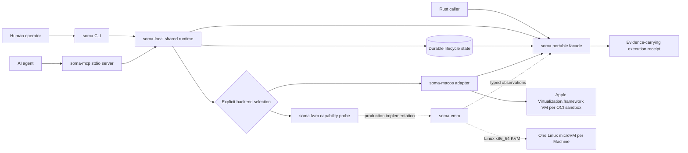
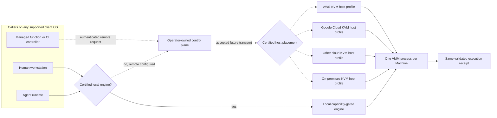
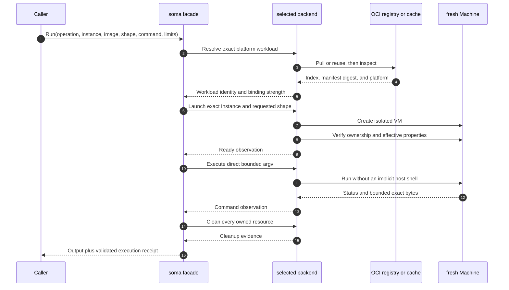
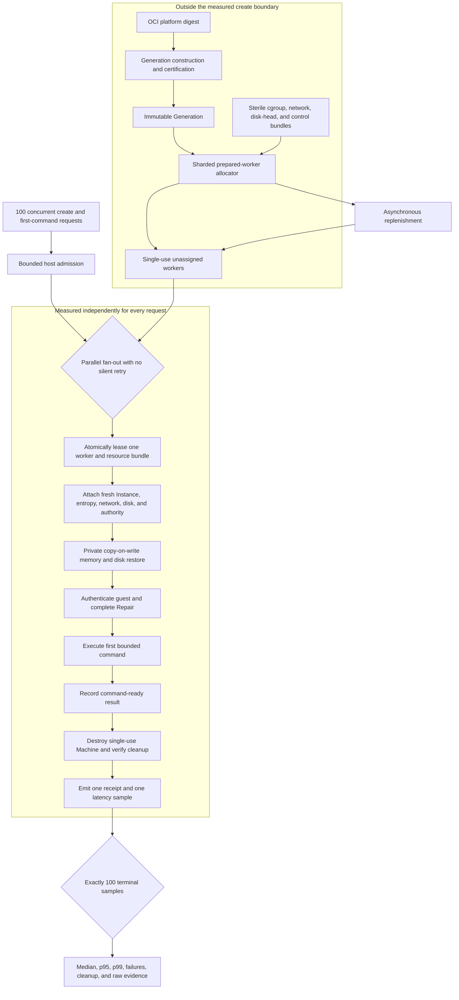
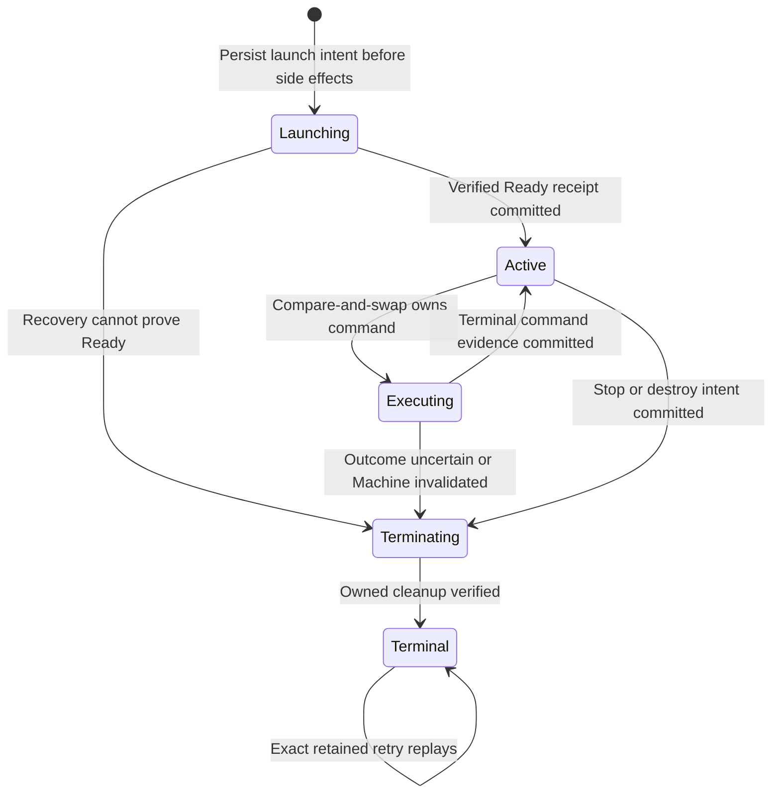
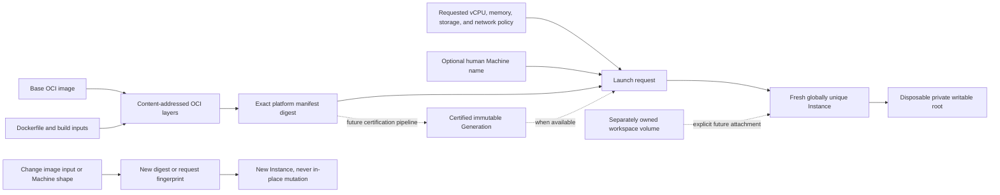
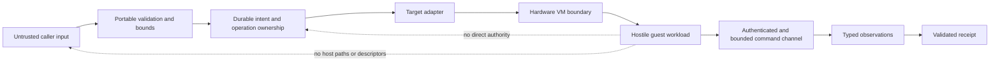

# SOMA architecture diagrams

## How to read these diagrams

Solid paths describe implemented alpha boundaries or mandatory contract transitions.
Dashed paths describe accepted production designs that still require implementation and retained evidence.
The diagrams distinguish current behavior from performance targets so an architectural picture is never mistaken for a benchmark result.

## Product and dependency topology

The CLI and MCP server differ only at their protocol and rendering boundaries.
Local lifecycle orchestration, durable state, target selection, and evidence mapping remain shared so human and agent behavior cannot drift.
The current Apple path is development-only, and the dashed KVM path remains a production target until its real guest lifecycle passes the required gates.

## Portable cloud and on-premises deployment

The public caller interface does not change with host placement.
Cloud and on-premises engine support attaches to an exact certified host profile, while environments without virtualization authority remain clients.
The remote transport and production KVM profiles are dashed because they are accepted designs rather than implemented alpha claims.
See the [deployment portability contract](../operations/deployment-portability.md) for admission requirements and evidence levels.

## One-shot execution contract

The portable transaction never treats process creation alone as command readiness.
The production KVM backend must add authenticated guest Repair and a successful authenticated first command before its Ready observation.
The Apple backend reports only the properties that Apple Container 1.3 can actually enforce or verify.

## Target path for a 100-sandbox burst

This is the accepted production fast-path design, not a current performance claim.
Preparation may move invariant work outside the timer, but it cannot carry tenant identity, mutable guest state, or reusable guest authority.
Every request still receives a unique Instance, private writable state, an authenticated first command, cleanup evidence, and an included sample.
The authoritative measurement rules are in the [benchmark contract](../benchmark-contract.md), while provider facts and unknowns remain in [the competitor ledger](../../COMPETITORS.md).

## Durable managed lifecycle

Every arrow is a durable revisioned compare-and-swap rather than an in-memory assumption.
A process crash in `Executing` never authorizes a second copy of an uncertain command.
A crash in `Terminating` resumes idempotent cleanup, and a corrupt or unsupported state record fails closed.

## Reproducible customization and replacement

Incremental customization reuses unchanged OCI layers and later Generation artifacts without reusing mutable Machine identity.
CPU, memory, storage, image, and network changes create a replacement Instance.
Persistent workspace data remains a separate lifecycle and ownership contract rather than being confused with the disposable root size.

## Security boundary summary

The threat model treats guest memory, device queues, image metadata, state documents, process output, and retry input as hostile.
The [threat model](../threat-model.md) defines the intended security invariants and current implementation limits.
